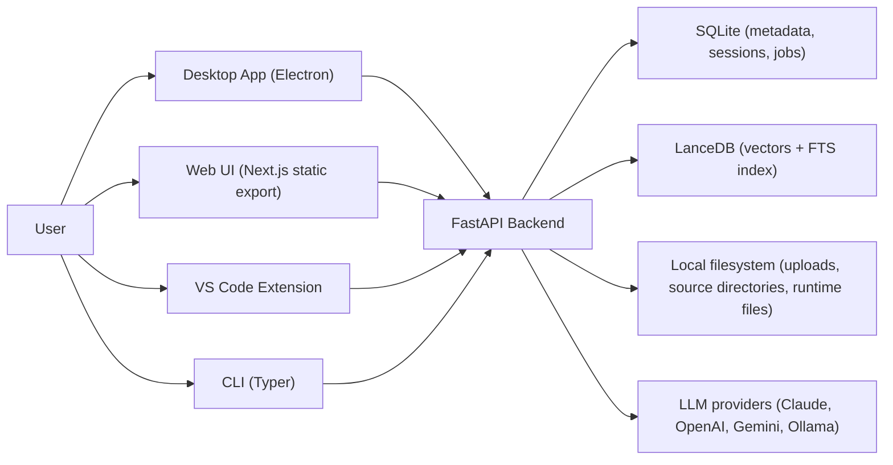

# momodoc

Momodoc is a local-first RAG knowledge system for project files, notes, and issues. A single FastAPI backend powers four clients: a desktop app, a static web frontend, a VS Code extension, and a CLI.

## Architecture



## What Exists Today

- Projects with optional `source_directory` for background sync and file watching
- File ingestion by upload, one-shot directory indexing, and long-running sync jobs
- Indexed notes and issues alongside files
- Global search and project-scoped search
- Project chat and global chat sessions, including SSE streaming endpoints
- Provider-backed chat with Claude, OpenAI, Gemini, or Ollama, plus search-only mode in the UI
- Desktop-only features including tray integration, overlay chat, startup profiles, diagnostics, onboarding, and packaged auto-updates
- Export endpoints for chat sessions and search results
- Metrics endpoints and a retrieval-evaluation CLI command

## Quick Start

### Prerequisites

- Python 3.11, 3.12, or 3.13
- Node.js for the desktop/frontend/extension workspaces

### Backend only

```bash
make momo-install
cp .env.example .env
make serve
```

The backend default URL is `http://127.0.0.1:8000`.

### Development workflows

```bash
# backend with reload
make dev

# desktop app (expects the frontend deps to be installed in desktop/)
make dev-desktop

# web frontend
cd frontend && npm install && npm run dev

# VS Code extension
cd extension && npm install && npm run compile
```

### Important runtime notes

- The server writes runtime files into the Momodoc data directory, including `momodoc.pid`, `momodoc.port`, and `session.token`.
- Directory indexing and `source_directory` sync are blocked unless `ALLOWED_INDEX_PATHS` is configured.
- The backend serves `backend/static/` if present. The `frontend` workspace builds a static export (`frontend/out`) that can be copied there.
- Desktop packaged builds prefer the bundled backend runtime; development and the VS Code extension use `momodoc serve`.

## Documentation

### User docs

| Document | Content |
|----------|---------|
| [Desktop Install](docs/user/desktop-install.md) | Recommended install path for the packaged desktop app |
| [Command-Line Install](docs/user/command-line-install.md) | Release installer scripts for desktop builds |
| [Tutorial](docs/user/tutorial.md) | End-to-end product guide across desktop, web, CLI, and extension |
| [Desktop Troubleshooting](docs/user/desktop-troubleshooting.md) | Diagnostics-first support guide for desktop startup/runtime issues |
| [VS Code Extension](docs/user/vscode-extension.md) | Extension commands, sidebar chat, and backend connectivity |
| [Log Files](docs/user/logging.md) | Runtime log locations and debugging checklist |

### Developer docs

| Document | Content |
|----------|---------|
| [Architecture](docs/dev/architecture.md) | Current runtime and data-flow architecture |
| [API Patterns](docs/dev/api-patterns.md) | Backend conventions, auth, routers, and endpoint shape |
| [Data Model](docs/dev/data-model.md) | SQLite tables, LanceDB schema, and migration behavior |
| [Frontend Guide](docs/dev/frontend-guide.md) | Shared renderer architecture, frontend bootstrap, and UI conventions |
| [Ingestion Pipeline](docs/dev/ingestion-pipeline.md) | Parsing, chunking, embedding, sync, and path safety |
| [Testing](docs/dev/testing.md) | Backend, frontend, desktop, and extension test layout |
| [DevOps](docs/dev/devops.md) | Runtime files, env vars, CLI lifecycle, and packaging-adjacent operations |
| [Contributing](docs/dev/contributing.md) | Local setup, workflow, and repo conventions |
| [Logging](docs/dev/logging.md) | Backend and desktop logging behavior |

Desktop-maintainer docs live in [docs/dev/desktop/](docs/dev/desktop/).

### Portfolio docs

| Document | Content |
|----------|---------|
| [Portfolio Overview](docs/portfolio/README.md) | Entry point for architecture deep-dives |
| [System Design](docs/portfolio/system-design.md) | System-level tradeoffs and runtime boundaries |
| [RAG Pipeline](docs/portfolio/rag-pipeline.md) | Retrieval pipeline and query-time planning |
| [Data Architecture](docs/portfolio/data-architecture.md) | SQLite/LanceDB split and vector-store concurrency model |
| [LLM Abstraction](docs/portfolio/llm-abstraction.md) | Provider factory, model metadata, and streaming interface |
| [Desktop Engineering](docs/portfolio/desktop-engineering.md) | Sidecar lifecycle, IPC, overlay, and packaged runtime decisions |
| [Architecture Decisions](docs/portfolio/architecture-decisions.md) | Architecture decision records grounded in the current codebase |

## Repository Layout

```text
momodoc/
  backend/
    app/
      bootstrap/          # lifespan, route registration, watcher startup
      core/               # DB, vector store, logging, auth helpers, rate limiting
      llm/                # provider implementations and registry/factory
      middleware/         # request logging and session-token auth
      models/             # SQLAlchemy ORM models
      routers/            # REST + websocket entry points
      schemas/            # Pydantic request/response models
      services/           # business logic, retrieval, sync, ingestion, metrics
    cli/                  # Typer CLI
    migrations/           # Alembic migrations
    tests/                # pytest unit/integration coverage
  desktop/
    src/main/             # Electron main process, sidecar, IPC, updater, diagnostics
    src/renderer/         # desktop renderer bootstrap and wrappers
    src/shared/           # shared desktop config and settings metadata
    tests/                # Vitest unit/integration and Playwright E2E tests
  frontend/
    src/app/              # Next.js app entry points
    src/components/       # web app shell and wrapper components
    src/shared/renderer/  # shared UI, hooks, API client core, styling
    tests/                # Vitest integration tests and Playwright E2E tests
  extension/
    src/                  # VS Code extension host, webview provider, API client, sidecar
    media/                # sidebar webview assets
  docs/
    dev/
    portfolio/
    user/
```

## License

See [LICENSE](LICENSE).
