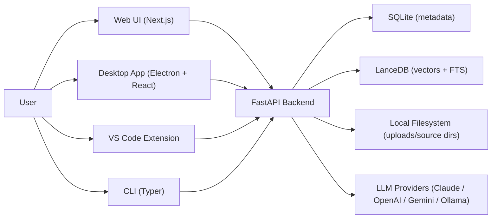

# momodoc

Personal RAG-based knowledge management for local files, notes, and issues. Organize content into projects, then query it with AI-powered chat that retrieves relevant context and cites sources. Everything except chat runs without an API key.

## Architecture



Four clients connect to a single FastAPI backend. The backend manages all data (SQLite for metadata, LanceDB for vectors) and orchestrates the RAG pipeline.

## Core Features

- Projects with optional `source_directory` for auto-sync
- File ingestion: upload, index directory, background sync jobs
- Notes and issues (both indexed for retrieval)
- Search modes: `hybrid` (default), `vector`, `keyword`
- Project chat + global chat sessions with streaming (SSE)
- Switchable LLM providers (Claude, OpenAI, Gemini, Ollama) per request
- Batch operations, export (Markdown/JSON), and metrics
- Desktop overlay chat via global hotkey

## Quick Start

### Prerequisites

- Python 3.11+
- Node.js 18+

### Install and run

```bash
make momo-install
cp .env.example .env   # optional; needed for cloud LLM providers
make serve
```

The backend listens on `http://127.0.0.1:8000` by default.

> **Important:** Directory indexing and `source_directory` sync require `ALLOWED_INDEX_PATHS` in your `.env`. When empty, all directory indexing/sync operations are rejected.

## Documentation

### For Users

Setup, usage, and troubleshooting:

| Document | Content |
|----------|---------|
| [Desktop Install](docs/user/desktop-install.md) | Download and install the desktop app |
| [Command-Line Install](docs/user/command-line-install.md) | One-command desktop installers (curl/PowerShell) |
| [Tutorial](docs/user/tutorial.md) | Comprehensive guide across all surfaces |
| [Desktop Troubleshooting](docs/user/desktop-troubleshooting.md) | Diagnostics-first troubleshooting |
| [VS Code Extension](docs/user/vscode-extension.md) | Extension install, commands, sidebar chat |
| [Log Files](docs/user/logging.md) | Log locations and debugging checklist |

### For Developers

Architecture, APIs, and development workflow:

| Document | Content |
|----------|---------|
| [Architecture](docs/dev/architecture.md) | Full system design: backend, desktop, extension, shared UI |
| [API Patterns](docs/dev/api-patterns.md) | Conventions, auth, schemas, endpoints, streaming |
| [Data Model](docs/dev/data-model.md) | SQLite tables, LanceDB schema, migrations |
| [Frontend Guide](docs/dev/frontend-guide.md) | Next.js, React, Tailwind, shared renderer |
| [Ingestion Pipeline](docs/dev/ingestion-pipeline.md) | Parsers, chunkers, embedding, sync |
| [Testing](docs/dev/testing.md) | pytest, fixtures, coverage, conventions |
| [DevOps](docs/dev/devops.md) | Lifecycle, Makefile, env config, CLI |
| [Contributing](docs/dev/contributing.md) | Dev setup, coding standards, workflow |
| [Logging](docs/dev/logging.md) | Logging architecture and middleware |

Desktop-specific dev docs are in [docs/dev/desktop/](docs/dev/desktop/).

### Portfolio

Technical deep-dives on design decisions, tradeoffs, and implementation:

| Document | Content |
|----------|---------|
| [System Design](docs/portfolio/system-design.md) | Multi-client architecture, tech stack rationale |
| [RAG Pipeline](docs/portfolio/rag-pipeline.md) | Parsing, chunking, embedding, hybrid search |
| [Data Architecture](docs/portfolio/data-architecture.md) | Dual-store design, async concurrency patterns |
| [LLM Abstraction](docs/portfolio/llm-abstraction.md) | Provider factory, streaming, rate limiting |
| [Desktop Engineering](docs/portfolio/desktop-engineering.md) | Sidecar lifecycle, IPC, overlay, shared UI |
| [Architecture Decisions](docs/portfolio/architecture-decisions.md) | 8 ADRs with alternatives and rationale |

## Repository Layout

```text
momodoc/
  backend/
    app/
      bootstrap/        # startup, routes, exceptions, watcher
      core/             # database, vectordb, async_vectordb, exceptions, security
      middleware/        # auth, logging
      models/           # SQLAlchemy ORM (10 tables)
      schemas/          # Pydantic request/response models
      routers/          # 12 API routers
      services/         # business logic + services/ingestion/
      llm/              # provider abstraction (claude, openai, gemini, ollama, factory)
    cli/                # Typer CLI
    migrations/
    tests/
  desktop/
    src/main/           # Electron main (sidecar, IPC, window factory, updater)
    src/renderer/       # React components (thin wrappers over shared)
    src/shared/         # app-config, desktop-settings
  frontend/
    src/
      shared/renderer/  # Shared components, lib, CSS (consumed by frontend + desktop)
      components/       # Thin wrappers re-exporting from shared/renderer/
      lib/              # Frontend-specific api bootstrap
  extension/
    src/                # VS Code extension (sidecar, chat, API, shared helpers)
    media/              # chat.html, chat.js, chat.css
  docs/
    user/               # End-user guides
    dev/                # Developer reference
    portfolio/          # Technical portfolio
```

## License

See [LICENSE](LICENSE).
